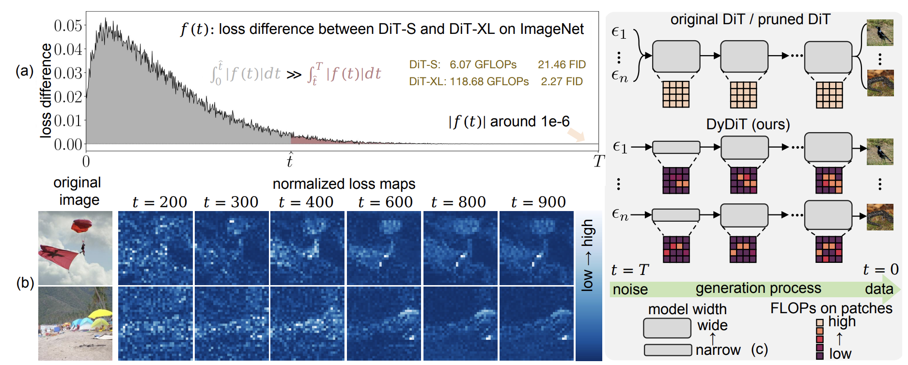
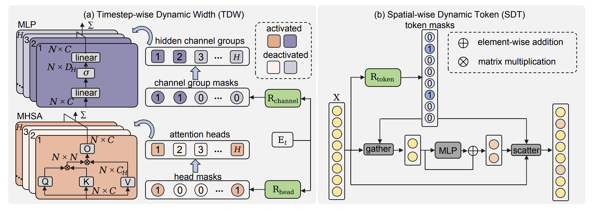

<h1 align="center"> <p>Dynamic Diffusion Transformer</p></h1>

<p align="center">
  <picture>
    
  </picture>
</p>

The official implementation of "2024 Dynamic Diffusion Transformer".


Wangbo Zhao<sup>1</sup>, Yizeng Han<sup>2</sup>,  Jiasheng Tang<sup>2,3</sup>,  Kai Wang<sup>1</sup>, Yibing Song<sup>2,3</sup>, Gao Huang<sup>4</sup>, Fan Wang<sup>2</sup>, Yang You<sup>1</sup>

<sup>1</sup>[National University of Singapore](https://www.nus.edu.sg/), <sup>2</sup>[DAMO Academy, Alibaba Group](https://damo.alibaba.com/?language=zh), <sup>3</sup>Hupan Lab, <sup>4</sup>[Tsinghua University](https://www.tsinghua.edu.cn/)

[Paper](https://arxiv.org/html/2410.03456v1)

https://github.com/user-attachments/assets/44ef5f81-cfe0-4e59-b228-14cc0729f5c6

We compare the generation speed of original DiT and the proposed DyDiT with $\lambda=0.5$ on a NVIDIA V100 32G GPU.


Images generated by DyDiT with $\lambda=0.5$.


> **Abstract:**
Diffusion Transformer (DiT), an emerging diffusion model for image generation, has demonstrated superior performance but suffers from substantial computational costs. Our investigations reveal that these costs stem from the static inference paradigm, which inevitably introduces redundant computation in certain diffusion timesteps and spatial regions. To address this inefficiency, we propose Dynamic Diffusion Transformer (DyDiT), an architecture that dynamically adjusts its computation along both timestep and spatial dimensions during generation. Specifically, we introduce a Timestep-wise Dynamic Width (TDW) approach that adapts model width conditioned on the generation timesteps. In addition, we design a Spatial-wise Dynamic Token (SDT) strategy to avoid redundant computation at unnecessary spatial locations. Extensive experiments on various datasets and different-sized models verify the superiority of DyDiT. Notably, with <3% additional fine-tuning iterations, our method reduces the FLOPs of DiT-XL by 51%, accelerates generation by 1.73, and achieves a competitive FID score of 2.07 on ImageNet.


## 🚀 News
- `2025.01.23` DyTDyT is accepted by ICLR 2025!!! We will update the code and paper soon.
- `2024.12.19:` We release the code for inference. 
- `2024.10.04:` Our paper is released.

## 🎯 TODO
- [x] Release the code for inference.

- [ ] Release the code for training.

- [ ] Release the code for applying our method to additional models (e.g., U-ViT, SiT).

- [ ] Release the code for applying our method to text-to-image and text-to-video generation diffusion models.


## 💥 Overview

(a) The loss difference between DiT-S and DiT-XL across all diffusion timesteps (T = 1000). The difference is slight at most timesteps.

(b) Loss maps (normalized to the range [0, 1]) at different timesteps, show that the noise in different patches has varying levels of difficulty to predict. 

(c) Difference of the inference paradigm between the static DiT and the proposed DyDiT


Overview of the proposed dynamic diffusion transformer (DyDiT). It reduces the
computational redundancy in DiT from both timestep and spatial dimensions.

## 🔨 Install

We provide an environment.yml file to help create the Conda environment in our experiments. Other environments may also works well.

```
git clone https://github.com/NUS-HPC-AI-Lab/Dynamic-Diffusion-Transformer.git
conda env create -f environment.yml
conda activate DyDiT
```


## ⚙️ Inference
Currently, we provide a pre-trained checkpoint of DyDiT $\lambda=0.7$.
| model                     |FLOPs (G) | FID    | download    
|-------------------------------|-|-----------|-----------
| DiT | 118.69 | 2.27 | - 
|DyDiT $\lambda=0.7$| 84.33 |  2.12 | [🤗](https://huggingface.co/heisejiasuo/DyDiT/resolve/main/dydit_0.7.pth?download=true)
|DyDiT $\lambda=0.5$| - |  - | in progress


Run sample_0.7.sh to sample images and evaluate the performance.
```
bash  sample_0.7.sh
```

The sample_ddp.py script which samples 50,000 images in parallel. It generates a folder of samples as well as a .npz file which can be directly used with [ADM's TensorFlow evaluation suite](https://github.com/openai/guided-diffusion/tree/main/evaluations) to compute FID, Inception Score and other metrics.  Please follow its instructions to download the reference batch VIRTUAL_imagenet256_labeled.npz.


## 🤔 Cite DyDiT
If you found our work useful, please consider citing us.
```
@article{zhao2024dynamic,
  title={Dynamic diffusion transformer},
  author={Zhao, Wangbo and Han, Yizeng and Tang, Jiasheng and Wang, Kai and Song, Yibing and Huang, Gao and Wang, Fan and You, Yang},
  journal={arXiv preprint arXiv:2410.03456},
  year={2024}
}
```

## ☎️ Contact
If you're interested in collaborating with us, feel free to reach out via email at wangbo.zhao96@gmail.com.

